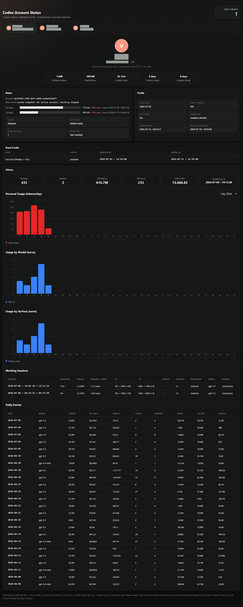

# Codex Account Status Dashboard

A self-contained local dashboard for checking Codex reset credits, current usage windows, and profile stats across one or more Codex accounts.



## Features

- Shows saved Codex accounts as tabs, with one account selected at a time.
- Displays available Codex reset credits across all saved accounts.
- Shows each reset credit with status, `granted_at`, and `expires_at` in `YYYY-MM-DD • HH:MM:SS` local-time format.
- Displays current 5-hour and 7-day Codex usage windows with remaining percentage and reset time.
- Displays profile-card stats similar to the Codex UI, including lifetime tokens, peak tokens, longest task, current streak, and longest streak.
- Tracks account history in a dedicated History card with month-selectable full-calendar daily usage bars, model and surface charts, dated per-model usage entries, estimated API dollar cost, and inferred working-session rows from successful polls.
- Uses absolute chart axes: Personal Usage has left-side token gridlines every 5M tokens, while Model and Surface charts have left-side turn gridlines every 5 turns.
- Shows current 5-hour and 7-day usage in the Status card with the original remaining-usage bar, plus red consumed-percentage labels next to the remaining percentage.
- Polls the currently active `~/.codex/auth.json` account live, then caches the latest successful snapshot per account.
- Generates an `index.html` page that refreshes the active account every 30 seconds through a local `127.0.0.1` proxy and falls back to cached data if live fetches fail.
- Does not embed OAuth access or refresh tokens in `index.html`.

## Files

- `CodexResets.ps1`: Starts the local browser/proxy server, refreshes the active Codex account, updates caches/history, and regenerates `index.html` when needed.
- `index.html`: The generated self-contained dashboard.
- `.codex-cache/`: Local cached account snapshots from successful live polls. This directory is ignored by git.
- `.codex-cache/history/`: Local per-account history files with successful polling samples, inferred sessions, and analytics usage rows. This directory is ignored by git.

## How It Works

Codex stores the currently active account auth data in:

```powershell
~/.codex/auth.json
```

That file normally contains only one active account at a time. Because saved credentials can stop working after account switches, the script only polls the currently active account. When polling succeeds, it writes a sanitized snapshot to `.codex-cache/`. The generated page displays cached snapshots for other accounts and periodically refreshes only the active account through the local proxy server.

The script and browser page query:

- `GET https://chatgpt.com/backend-api/wham/usage`
- `GET https://chatgpt.com/backend-api/wham/profiles/me`
- `GET https://chatgpt.com/backend-api/wham/rate-limit-reset-credits`
- `GET https://chatgpt.com/backend-api/wham/analytics/daily-workspace-usage-counts?start_date=YYYY-MM-DD&end_date=YYYY-MM-DD&group_by=day`

The requests send the same auth pattern Codex uses: `Authorization: Bearer ...`, `ChatGPT-Account-ID`, `OpenAI-Beta: codex-1`, and `originator: Codex Desktop`.

The analytics endpoint returns the daily source data used for Codex usage charts, including totals, clients/surfaces, and models. The local server stores that data in `.codex-cache/history/` when a live refresh succeeds. If the analytics endpoint fails, the page keeps the last successful analytics cache and still records polling samples from the other endpoints.

History charts render every day in the selected month, including empty days, and are constrained to the panel width at narrow desktop sizes. If the daily analytics endpoint has not published today's bucket yet, the page appends a live-sample row aggregated from all polling samples recorded today. When token deltas are unavailable but usage-window movement proves activity happened, the current-day token bar is marked as an estimate based on recent average tokens per turn.

Working sessions are inferred from polling samples. A session stays open across short polling gaps and only closes after at least five minutes without additional usage movement, or when usage counters reset/decrease. Session rows include duration, 5-hour and 7-day percentage movement, reset-credit movement, sample count, reasoning, model mix, and surface. When exact per-session token/thread counts are not returned by the polling endpoint, the dashboard allocates the day's analytics totals across sessions by usage-window movement and marks estimated values with `≈`. Model mix is only shown when that day's analytics row includes model data; otherwise current-day live samples show `N/A` rather than guessing from prior days.

Daily Entries use the original per-model row layout. The analytics endpoint currently returns daily token totals plus per-model turn counts, but not per-model token totals, so per-model token/cost/input/cache/output values are turn-share estimates only when the allocation is not ambiguous. If multiple reported model rows have identical model-only metrics or identical same-day allocation shares, their allocated token/cost fields are left blank instead of fabricating duplicate-looking values.

## Usage

Run from this project directory:

```powershell
.\CodexResets.ps1
```

The script refreshes or creates the local cache and `index.html` if they are missing, starts the local proxy server, and opens the dashboard in your default browser:

```text
http://127.0.0.1:8787/index.html
```

Use update-only mode when you only want to refresh the cached data and regenerate `index.html` without starting the server:

```powershell
.\CodexResets.ps1 -Update
```

The generated page refreshes the active account every 30 seconds while it is open. After switching Codex accounts, refresh the page or let the next 30-second poll run; the local server will detect the active account, update or create that account's tab, and save its latest snapshot/history.

To add new accounts simply sign into them in Codex with the server running and wait for the server to refresh the active account automatically. Each account appears as a tab after the script successfully polls it at least once and writes a cached snapshot.

## Script Options

```powershell
.\CodexResets.ps1 `
  -AuthPath "$HOME\.codex\auth.json" `
  -CacheDir ".\.codex-cache" `
  -Port 8787
```

- `-AuthPath`: Path to the active Codex auth file.
- `-CacheDir`: Directory where cached account snapshots are stored.
- `-Root`: Directory where `index.html` is written and served. Defaults to the script directory.
- `-Port`: Local server port. Defaults to `8787`.
- `-Update`: Refresh live data, regenerate `index.html`, and exit without starting the server.
- `-SkipBrowser`: Start the server without opening the default browser.

## Privacy And Security

The `.codex-cache/` directory contains personal account telemetry. Keep it private and do not commit or share it.

`index.html` does not embed OAuth tokens. The local proxy reads the active `~/.codex/auth.json` server-side and should only be run on your machine.

## Troubleshooting

If an account tab only shows cached data, switch Codex to that account and rerun `.\CodexResets.ps1 -Update`.

If the live browser refresh fails, the page keeps showing the cached snapshot from the last successful script poll.

If PowerShell blocks script execution, run the script from a PowerShell session that allows local scripts, or invoke it with an appropriate execution policy for your machine.
