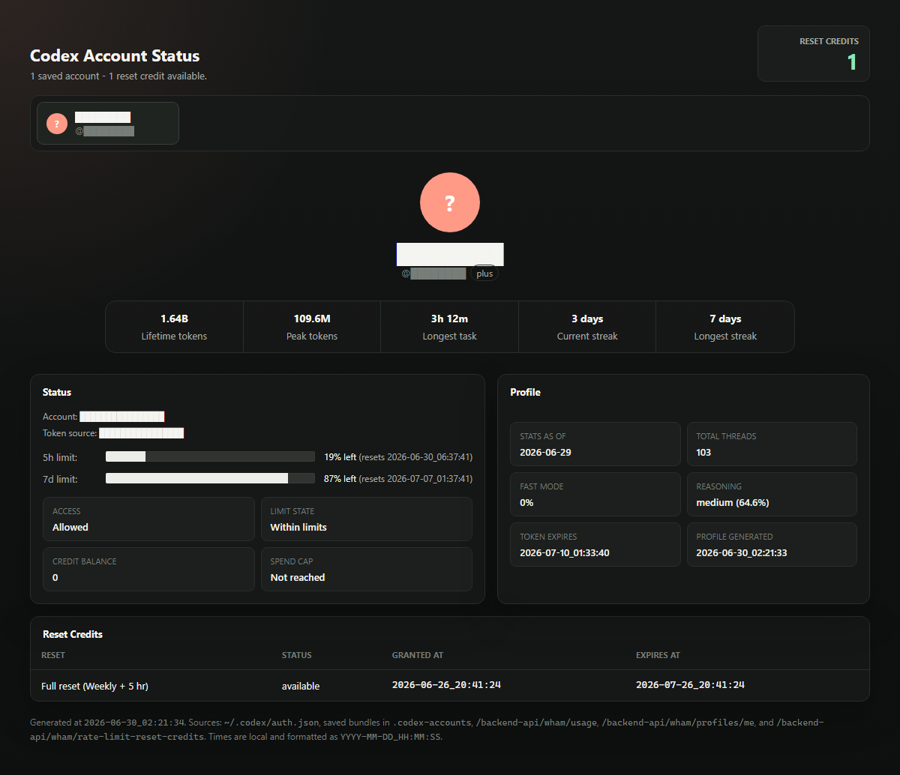

# Codex Account Status Dashboard

A self-contained local dashboard for checking Codex reset credits, current usage windows, and profile stats across one or more Codex accounts.



## Features

- Shows saved Codex accounts as tabs, with one account selected at a time.
- Displays available Codex reset credits across all saved accounts.
- Shows each reset credit with status, `granted_at`, and `expires_at` in `YYYY-MM-DD • HH:MM:SS` local-time format.
- Displays current 5-hour and 7-day Codex usage windows with remaining percentage and reset time.
- Displays profile-card stats similar to the Codex UI, including lifetime tokens, peak tokens, longest task, current streak, and longest streak.
- Polls the currently active `~/.codex/auth.json` account live, then caches the latest successful snapshot per account.
- Generates an `index.html` page that refreshes the active account every 30 seconds through a local `127.0.0.1` proxy and falls back to cached data if live fetches fail.
- Does not embed OAuth access or refresh tokens in `index.html`.

## Files

- `Update-CodexResets.ps1`: Queries the active Codex account, updates that account's cached snapshot, writes the local proxy URL, and regenerates `index.html`.
- `Start-CodexResetsServer.ps1`: Starts the local browser/proxy server used for live refreshes.
- `index.html`: The generated self-contained dashboard.
- `.codex-cache/`: Local cached account snapshots from successful live polls. This directory is ignored by git.
- `dashboard-screenshot.png`: Redacted screenshot for documentation.
- `.gitignore`: Prevents saved auth bundles from being committed.

## How It Works

Codex stores the currently active account auth data in:

```powershell
~/.codex/auth.json
```

That file normally contains only one active account at a time. Because saved credentials can stop working after account switches, the script only polls the currently active account. When polling succeeds, it writes a sanitized snapshot to `.codex-cache/`. The generated page displays cached snapshots for other accounts and periodically refreshes only the active account through the local proxy server.

The script and browser page query:

- `GET https://chatgpt.com/backend-api/wham/usage`
- `GET https://chatgpt.com/backend-api/wham/profiles/me`
- `GET https://chatgpt.com/backend-api/wham/rate-limit-reset-credits`

The requests send the same auth pattern Codex uses: `Authorization: Bearer ...`, `ChatGPT-Account-ID`, `OpenAI-Beta: codex-1`, and `originator: Codex Desktop`.

## Usage

Run from this project directory:

```powershell
.\Update-CodexResets.ps1
```

Then open:

```text
http://127.0.0.1:8787/index.html
```

Start the local proxy server first:

```powershell
.\Start-CodexResetsServer.ps1
```

The generated page refreshes the active account every 30 seconds while it is open. Rerun the update script after switching Codex accounts so that account becomes the live account in the page and its cached snapshot gets updated.

## Adding Accounts

1. Sign into or switch to an account in Codex.
2. Run `.\Update-CodexResets.ps1`.
3. Repeat for each account you want included.

Each account appears as a tab after the script successfully polls it at least once and writes a cached snapshot.

## Script Options

```powershell
.\Update-CodexResets.ps1 `
  -AuthPath "$HOME\.codex\auth.json" `
  -CacheDir ".\.codex-cache" `
  -OutputPath ".\index.html"
```

- `-AuthPath`: Path to the active Codex auth file.
- `-CacheDir`: Directory where cached account snapshots are stored.
- `-OutputPath`: Destination for the generated HTML page.
- `-SkipSaveCurrent`: Render cached snapshots without polling the active auth file.
- `-SkipFetch`: Regenerate the page without querying the backend; useful for layout testing.

## Privacy And Security

The `.codex-cache/` directory contains personal account telemetry. Keep it private and do not commit or share it.

`index.html` does not embed OAuth tokens. The local proxy reads the active `~/.codex/auth.json` server-side and should only be run on your machine.

## Troubleshooting

If an account tab only shows cached data, switch Codex to that account and rerun `.\Update-CodexResets.ps1`.

If the live browser refresh fails, the page keeps showing the cached snapshot from the last successful script poll.

If PowerShell blocks script execution, run the script from a PowerShell session that allows local scripts, or invoke it with an appropriate execution policy for your machine.
